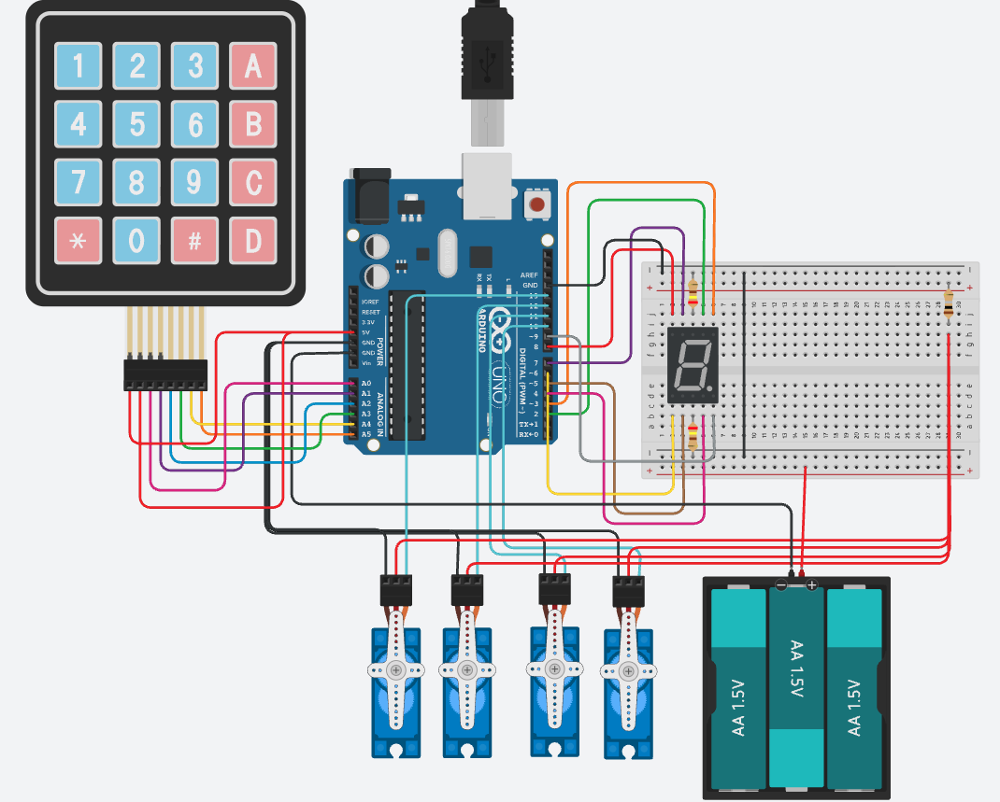

# Smart Robotic Arm
My project: Arduino Robotic Arm, is an enhanced version of the original. With a segmented digital display as directional indicators to showcase the direction of the arm, it allows tasks done by the robotic arm to be completed more effeciently and accurately. For instance, for industrial applications, if the robotic arm is large or hidden, it prevents operators to fully supervise arm's orientation. In which having a directional indicator as a modification could provides the operator with immediate confirmation that the input is being received by the system and an accurate control over the arm. The biggest challenge in this project...

```HTML 
<!--- This is an HTML comment in Markdown -->
1. references
2. expand on description for m1 and m2
<!--- Anything between these symbols will not render on the published site -->
```

| **Engineer** | **School** | **Area of Interest** | **Grade** |
|:--:|:--:|:--:|:--:|
| Adrian Kan | Athenian School | Mechanical Engineering | Rising Junior | 

**Replace the BlueStamp logo below with an image of yourself and your completed project. Follow the guide [here](https://tomcam.github.io/least-github-pages/adding-images-github-pages-site.html) if you need help.**


  
# Final Milestone

**Don't forget to replace the text below with the embedding for your milestone video. Go to Youtube, click Share -> Embed, and copy and paste the code to replace what's below.**

<iframe width="560" height="315" src="https://www.youtube.com/embed/F7M7imOVGug" title="YouTube video player" frameborder="0" allow="accelerometer; autoplay; clipboard-write; encrypted-media; gyroscope; picture-in-picture; web-share" allowfullscreen></iframe>

For your final milestone, explain the outcome of your project. Key details to include are:
- What you've accomplished since your previous milestone
- What your biggest challenges and triumphs were at BSE
- A summary of key topics you learned about
- What you hope to learn in the future after everything you've learned at BSE


# Second Milestone

**Don't forget to replace the text below with the embedding for your milestone video. Go to Youtube, click Share -> Embed, and copy and paste the code to replace what's below.**

<iframe width="560" height="315" src="https://www.youtube.com/embed/y3VAmNlER5Y" title="YouTube video player" frameborder="0" allow="accelerometer; autoplay; clipboard-write; encrypted-media; gyroscope; picture-in-picture; web-share" allowfullscreen></iframe>

For your second milestone, explain what you've worked on since your previous milestone. You can highlight:
- Technical details of what you've accomplished and how they contribute to the final goal
- What has been surprising about the project so far
- Previous challenges you faced that you overcame
- What needs to be completed before your final milestone

- Implemented 7-segmented digital display
- Wired and Connected the display with arduino using breadboard and resistors
- Ensured that the display can be powered
- Learned to power breadboard with external battery

# First Milestone

<iframe width="560" height="315" src="https://www.youtube.com/embed/ZU30pw0DPhA?si=AgRVI8BZ4kNFEeqe" title="YouTube video player" frameborder="0" allow="accelerometer; autoplay; clipboard-write; encrypted-media; gyroscope; picture-in-picture; web-share" referrerpolicy="strict-origin-when-cross-origin" allowfullscreen></iframe>
        
- The plan for this milestone was to finish the baseline project: The Robotic Arm
- Wired the servo with arduino
- Wired Joystick with arduino
- Used the reference code to connect the joystick with robotic arm through arduino to make it function
- Challenge faced: the wiring was really confusing in terms of the corresponding places like ground, voltage, and signal, and the coordinates

# Schematics 
Wiring Diagram of the Robotic Arm (4 Servos) & Joystick Controller & Segmented Display


Notes:
* The 4x4 Keypad is used to substitute the Joystick Controller due to the limitations on Tinkercad (program used to create this schematic)
* 4.5V Battery is used to substitute the 9V battery used in the physical model

# C++ Codes for Arduino

Code for Joystick to Control the Robotic Arm With Display flashing numbers from 1-9
```c++
#include "src/CokoinoArm.h"

#define buzzerPin 9  // Dedicated solely to the buzzer now!

// Your brand new collision-free pin mappings
int a = 11;
int b = 2;
int c = 13;
int d = 12;
int e = 3;
int f = 8;
int g = 10;

CokoinoArm arm;
int xL, yL, xR, yR;

const int act_max = 5;
int act[act_max][4];    
int num = 0, num_do = 0;

// Non-blocking timer configuration for smooth flashing
unsigned long lastDisplayUpdate = 0;
const long interval = 400;  // Flashing speed (400ms per digit)
int currentDigit = 1;

// Helper function to render numbers 1-9
void displayDigit(int digit) {
  // Clear all segments first
  digitalWrite(a, LOW);   digitalWrite(b, LOW);   digitalWrite(c, LOW);
  digitalWrite(d, LOW);   digitalWrite(e, LOW);   digitalWrite(f, LOW);
  digitalWrite(g, LOW);

  // Turn on segments according to the digit (Common Cathode)
  switch (digit) {
    case 1:
      digitalWrite(b, HIGH); digitalWrite(c, HIGH);
      break;
    case 2:
      digitalWrite(a, HIGH); digitalWrite(b, HIGH); digitalWrite(d, HIGH); digitalWrite(e, HIGH); digitalWrite(g, HIGH);
      break;
    case 3:
      digitalWrite(a, HIGH); digitalWrite(b, HIGH); digitalWrite(c, HIGH); digitalWrite(d, HIGH); digitalWrite(g, HIGH);
      break;
    case 4:
      digitalWrite(b, HIGH); digitalWrite(c, HIGH); digitalWrite(f, HIGH); digitalWrite(g, HIGH);
      break;
    case 5:
      digitalWrite(a, HIGH); digitalWrite(c, HIGH); digitalWrite(d, HIGH); digitalWrite(f, HIGH); digitalWrite(g, HIGH);
      break;
    case 6:
      digitalWrite(a, HIGH); digitalWrite(c, HIGH); digitalWrite(d, HIGH); digitalWrite(e, HIGH); digitalWrite(f, HIGH); digitalWrite(g, HIGH);
      break;
    case 7:
      digitalWrite(a, HIGH); digitalWrite(b, HIGH); digitalWrite(c, HIGH);
      break;
    case 8:
      digitalWrite(a, HIGH); digitalWrite(b, HIGH); digitalWrite(c, HIGH); digitalWrite(d, HIGH); digitalWrite(e, HIGH); digitalWrite(f, HIGH); digitalWrite(g, HIGH);
      break;
    case 9:
      digitalWrite(a, HIGH); digitalWrite(b, HIGH); digitalWrite(c, HIGH); digitalWrite(d, HIGH); digitalWrite(f, HIGH); digitalWrite(g, HIGH);
      break;
  }
}

// Background display engine to bypass long robot movement delays
void updateDisplay() {
  unsigned long currentMillis = millis();
  if (currentMillis - lastDisplayUpdate >= interval) {
    lastDisplayUpdate = currentMillis;
    displayDigit(currentDigit);
    currentDigit++;
    if (currentDigit > 9) {
      currentDigit = 1;
    }
  }
}

void setup() {
  // Initialize Display Pins
  pinMode(a, OUTPUT);  pinMode(b, OUTPUT);  pinMode(c, OUTPUT);  pinMode(d, OUTPUT);
  pinMode(e, OUTPUT);  pinMode(f, OUTPUT);  pinMode(g, OUTPUT);

  // Initialize Robotic Arm Components
  arm.ServoAttach(4, 5, 6, 7);        // Dedicated servo control pins
  arm.JoyStickAttach(A0, A1, A2, A3); // Joystick control pins
  pinMode(buzzerPin, OUTPUT);
}

void loop() {
  // 1. Refresh background display animation continuously
  updateDisplay();

  // 2. Read Joystick Positions
  xL = arm.JoyStickL.read_x();
  yL = arm.JoyStickL.read_y();
  xR = arm.JoyStickR.read_x();
  yR = arm.JoyStickR.read_y();
  
  date_processing(&xL, &yL);
  date_processing(&xR, &yR);
  
  // 3. Process Live Robot Movements & Actions
  turnUD();
  turnLR();
  turnCO();
  C_action();
  Do_action();
}

// === ROBOTIC ARM MECHANICAL LOGIC ===

void turnUD(void) {
  if (xL != 512) {
    if (0 <= xL && xL <= 100) { arm.up(10); return; }
    if (900 < xL && xL <= 1024) { arm.down(10); return; } 
    if (100 < xL && xL <= 200) { arm.up(20); return; }
    if (800 < xL && xL <= 900) { arm.down(20); return; }
    if (200 < xL && xL <= 300) { arm.up(25); return; }
    if (700 < xL && xL <= 800) { arm.down(25); return; }
    if (300 < xL && xL <= 400) { arm.up(30); return; }
    if (600 < xL && xL <= 700) { arm.down(30); return; }
    if (400 < xL && xL <= 480) { arm.up(35); return; }
    if (540 < xL && xL <= 600) { arm.down(35); return; } 
  }
}

void turnLR(void) {
  if (yL != 512) {
    if (0 <= yL && yL <= 100) { arm.right(0); return; }
    if (900 < yL && yL <= 1024) { arm.left(0); return; }  
    if (100 < yL && yL <= 200) { arm.right(5); return; }
    if (800 < yL && yL <= 900) { arm.left(5); return; }
    if (200 < yL && yL <= 300) { arm.right(10); return; }
    if (700 < yL && yL <= 800) { arm.left(10); return; }
    if (300 < yL && yL <= 400) { arm.right(15); return; }
    if (600 < yL && yL <= 700) { arm.left(15); return; }
    if (400 < yL && yL <= 480) { arm.right(20); return; }
    if (540 < yL && yL <= 600) { arm.left(20); return; }
  }
}

void turnCO(void) {
  if (xR != 512) {
    if (0 <= xR && xR <= 100) { arm.close(0); return; }
    if (900 < xR && xR <= 1024) { arm.open(0); return; } 
    if (100 < xR && xR <= 200) { arm.close(5); return; }
    if (800 < xR && xR <= 900) { arm.open(5); return; }
    if (200 < xR && xR <= 300) { arm.close(10); return; }
    if (700 < xR && xR <= 800) { arm.open(10); return; }
    if (300 < xR && xR <= 400) { arm.close(15); return; }
    if (600 < xR && xR <= 700) { arm.open(15); return; }
    if (400 < xR && xR <= 480) { arm.close(20); return; }
    if (540 < xR && xR <= 600) { arm.open(20); return; } 
  }
}

void date_processing(int *x, int *y) {
  if (abs(512 - *x) > abs(512 - *y)) {
    *y = 512;
  } else {
    *x = 512;
  }
}

void buzzer(int H, int L) {
  while (yR < 420) {
    digitalWrite(buzzerPin, HIGH);
    delayMicroseconds(H);
    digitalWrite(buzzerPin, LOW);
    delayMicroseconds(L);
    yR = arm.JoyStickR.read_y();
    updateDisplay(); // Maintains flashing sequence during active buzzer alerts
  }
  while (yR > 600) {
    digitalWrite(buzzerPin, HIGH);
    delayMicroseconds(H);
    digitalWrite(buzzerPin, LOW);
    delayMicroseconds(L);
    yR = arm.JoyStickR.read_y();
    updateDisplay(); // Maintains flashing sequence during active buzzer alerts
  }
}

void C_action(void) {
  if (yR > 800) {
    int *p;
    p = arm.captureAction();
    for (char i = 0; i < 4; i++) {
      act[num][i] = *p;
      p = p + 1;
    }
    num++;
    num_do = num;
    if (num >= act_max) {
      num = 0;
      buzzer(600, 400);
    }
    while (yR > 600) { 
      yR = arm.JoyStickR.read_y(); 
      updateDisplay();
    }
  }
}

void Do_action(void) {
  if (yR < 220) {
    buzzer(200, 300);
    for (int i = 0; i < num_do; i++) {
      arm.do_action(act[i], 15);
      updateDisplay(); // Keeps screen ticking forward while arm is completing playback loops
    }
    num = 0;
    while (yR < 420) { 
      yR = arm.JoyStickR.read_y(); 
      updateDisplay();
    }
    
    // Non-blocking approach for the end-of-sequence 1-second long tone
    for (int i = 0; i < 2000; i++) {
      digitalWrite(buzzerPin, HIGH);
      delayMicroseconds(200);
      digitalWrite(buzzerPin, LOW);
      delayMicroseconds(300);
      if (i % 100 == 0) {
        updateDisplay(); 
      }
    }
  }
}
```


Final Code: Directional Indicator - Syncronized Robotic Arm Controller and 7 Segmented Display 

```c++
#include "src/CokoinoArm.h"

#define buzzerPin 9  // Dedicated solely to the buzzer

// Collision-free display pin mapping
int a = 11;
int b = 2;
int c = 13;
int d = 12;
int e = 3;
int f = 8;
int g = 10;

CokoinoArm arm;
int xL, yL, xR, yR;

const int act_max = 5;
int act[act_max][4];    
int num = 0, num_do = 0;

// Global tracking variable for current numeric action state
int statusNum = 0;

// Helper function to render numbers 0-8 (Common Cathode)
void displayDigit(int digit) {
  // Clear all segments first
  digitalWrite(a, LOW);   digitalWrite(b, LOW);   digitalWrite(c, LOW);
  digitalWrite(d, LOW);   digitalWrite(e, LOW);   digitalWrite(f, LOW);
  digitalWrite(g, LOW);

  switch (digit) {
    case 0: // Idle / Standby
      digitalWrite(a, HIGH); digitalWrite(b, HIGH); digitalWrite(c, HIGH); digitalWrite(d, HIGH); digitalWrite(e, HIGH); digitalWrite(f, HIGH);
      break;
    case 1: // Left
      digitalWrite(b, HIGH); digitalWrite(c, HIGH);
      break;
    case 2: // Right
      digitalWrite(a, HIGH); digitalWrite(b, HIGH); digitalWrite(d, HIGH); digitalWrite(e, HIGH); digitalWrite(g, HIGH);
      break;
    case 3: // Up
      digitalWrite(a, HIGH); digitalWrite(b, HIGH); digitalWrite(c, HIGH); digitalWrite(d, HIGH); digitalWrite(g, HIGH);
      break;
    case 4: // Down
      digitalWrite(b, HIGH); digitalWrite(c, HIGH); digitalWrite(f, HIGH); digitalWrite(g, HIGH);
      break;
    case 5: // Close Claw
      digitalWrite(a, HIGH); digitalWrite(c, HIGH); digitalWrite(d, HIGH); digitalWrite(f, HIGH); digitalWrite(g, HIGH);
      break;
    case 6: // Open Claw
      digitalWrite(a, HIGH); digitalWrite(c, HIGH); digitalWrite(d, HIGH); digitalWrite(e, HIGH); digitalWrite(f, HIGH); digitalWrite(g, HIGH);
      break;
    case 7: // Save / Capture Position
      digitalWrite(a, HIGH); digitalWrite(b, HIGH); digitalWrite(c, HIGH);
      break;
    case 8: // Playback
      digitalWrite(a, HIGH); digitalWrite(b, HIGH); digitalWrite(c, HIGH); digitalWrite(d, HIGH); digitalWrite(e, HIGH); digitalWrite(f, HIGH); digitalWrite(g, HIGH);
      break;
  }
}

// Background display driver engine
void updateDisplay() {
  displayDigit(statusNum);
}

void setup() {
  // Initialize Display Pins
  pinMode(a, OUTPUT);  pinMode(b, OUTPUT);  pinMode(c, OUTPUT);  pinMode(d, OUTPUT);
  pinMode(e, OUTPUT);  pinMode(f, OUTPUT);  pinMode(g, OUTPUT);

  // Initialize Robotic Arm Components
  arm.ServoAttach(4, 5, 6, 7);
  arm.JoyStickAttach(A0, A1, A2, A3);
  pinMode(buzzerPin, OUTPUT);
}

void loop() {
  // Reset state to 0 (Idle) at the start of every cycle
  statusNum = 0;

  // Read Joystick Positions
  xL = arm.JoyStickL.read_x();
  yL = arm.JoyStickL.read_y();
  xR = arm.JoyStickR.read_x();
  yR = arm.JoyStickR.read_y();
  
  date_processing(&xL, &yL);
  date_processing(&xR, &yR);
  
  // Process Movements (these alter statusNum if active)
  turnUD();
  turnLR();
  turnCO();
  C_action();
  Do_action();

  // Push current numeric status to display hardware
  updateDisplay();
}

// === ROBOTIC ARM MECHANICAL LOGIC WITH STATE CAPTURE ===

void turnUD(void) {
  if (xL != 512) {
    if (0 <= xL && xL <= 100) { arm.up(10); statusNum = 3; return; }
    if (900 < xL && xL <= 1024) { arm.down(10); statusNum = 4; return; } 
    if (100 < xL && xL <= 200) { arm.up(20); statusNum = 3; return; }
    if (800 < xL && xL <= 900) { arm.down(20); statusNum = 4; return; }
    if (200 < xL && xL <= 300) { arm.up(25); statusNum = 3; return; }
    if (700 < xL && xL <= 800) { arm.down(25); statusNum = 4; return; }
    if (300 < xL && xL <= 400) { arm.up(30); statusNum = 3; return; }
    if (600 < xL && xL <= 700) { arm.down(30); statusNum = 4; return; }
    if (400 < xL && xL <= 480) { arm.up(35); statusNum = 3; return; }
    if (540 < xL && xL <= 600) { arm.down(35); statusNum = 4; return; } 
  }
}

void turnLR(void) {
  if (yL != 512) {
    if (0 <= yL && yL <= 100) { arm.right(0); statusNum = 2; return; }
    if (900 < yL && yL <= 1024) { arm.left(0); statusNum = 1; return; }  
    if (100 < yL && yL <= 200) { arm.right(5); statusNum = 2; return; }
    if (800 < yL && yL <= 900) { arm.left(5); statusNum = 1; return; }
    if (200 < yL && yL <= 300) { arm.right(10); statusNum = 2; return; }
    if (700 < yL && yL <= 800) { arm.left(10); statusNum = 1; return; }
    if (300 < yL && yL <= 400) { arm.right(15); statusNum = 2; return; }
    if (600 < yL && yL <= 700) { arm.left(15); statusNum = 1; return; }
    if (400 < yL && yL <= 480) { arm.right(20); statusNum = 2; return; }
    if (540 < yL && yL <= 600) { arm.left(20); statusNum = 1; return; }
  }
}

void turnCO(void) {
  if (xR != 512) {
    if (0 <= xR && xR <= 100) { arm.close(0); statusNum = 5; return; }
    if (900 < xR && xR <= 1024) { arm.open(0); statusNum = 6; return; } 
    if (100 < xR && xR <= 200) { arm.close(5); statusNum = 5; return; }
    if (800 < xR && xR <= 900) { arm.open(5); statusNum = 6; return; }
    if (200 < xR && xR <= 300) { arm.close(10); statusNum = 5; return; }
    if (700 < xR && xR <= 800) { arm.open(10); statusNum = 6; return; }
    if (300 < xR && xR <= 400) { arm.close(15); statusNum = 5; return; }
    if (600 < xR && xR <= 700) { arm.open(15); statusNum = 6; return; }
    if (400 < xR && xR <= 480) { arm.close(20); statusNum = 5; return; }
    if (540 < xR && xR <= 600) { arm.open(20); statusNum = 6; return; } 
  }
}

void date_processing(int *x, int *y) {
  if (abs(512 - *x) > abs(512 - *y)) {
    *y = 512;
  } else {
    *x = 512;
  }
}

void buzzer(int H, int L) {
  while (yR < 420) {
    digitalWrite(buzzerPin, HIGH);
    delayMicroseconds(H);
    digitalWrite(buzzerPin, LOW);
    delayMicroseconds(L);
    yR = arm.JoyStickR.read_y();
    updateDisplay();
  }
  while (yR > 600) {
    digitalWrite(buzzerPin, HIGH);
    delayMicroseconds(H);
    digitalWrite(buzzerPin, LOW);
    delayMicroseconds(L);
    yR = arm.JoyStickR.read_y();
    updateDisplay();
  }
}

void C_action(void) {
  if (yR > 800) {
    statusNum = 7; // Show Capture Status
    int *p;
    p = arm.captureAction();
    for (char i = 0; i < 4; i++) {
      act[num][i] = *p;
      p = p + 1;
    }
    num++;
    num_do = num;
    if (num >= act_max) {
      num = 0;
      buzzer(600, 400);
    }
    while (yR > 600) { 
      yR = arm.JoyStickR.read_y(); 
      updateDisplay();
    }
  }
}

void Do_action(void) {
  if (yR < 220) {
    statusNum = 8; // Show Playback Status
    buzzer(200, 300);
    for (int i = 0; i < num_do; i++) {
      arm.do_action(act[i], 15);
      updateDisplay();
    }
    num = 0;
    while (yR < 420) { 
      yR = arm.JoyStickR.read_y(); 
      updateDisplay();
    }
    
    for (int i = 0; i < 2000; i++) {
      digitalWrite(buzzerPin, HIGH);
      delayMicroseconds(200);
      digitalWrite(buzzerPin, LOW);
      delayMicroseconds(300);
      if (i % 100 == 0) {
        updateDisplay();
      }
    }
  }
}
```

# Bill of Materials
The below are the materials used for the project, and a brief description of the purpose of each component, attached with the purchase price and link for reference.

| **Part** | **Note** | **Price** | **Link** |
|:--:|:--:|:--:|:--:|
| Robotic Arm Kit | The baseline project | $46.99 | <a href="https://www.amazon.com/LK-COKOINO-Compliment-Engineering-Technology/dp/B081FG1JQ1/"> Link </a> |
| Servo Shield | Expands the function of the Servo | $10.99 | <a href="https://www.amazon.com/HiLetgo-Expansion-Sensor-Arduino-Duemilanove/dp/B07VQRCC8F/ref=sr_1_1_sspa?crid=IY8280UJPZ8D&dib=eyJ2IjoiMSJ9.gOnvWbSP2fpJyjlzThZoFsFPHoeaF2QpSk_jNdngKIr1twGn_LzcDoaoxYvFyCU-mVjs0xm0675XcM9jJCRLlzDOmjbGgP1sIqUhTjt4NviT5cbtoA-UvEYAIHWDWIfkb2aFMmhgHU544Wc7YJiipzzt3fuSGamCrVeh0ONFUE7GqEzOyVIpGdjm_kZqEYrk4l6Ol054nebh1I2eZg7hcYRPAX8iNqbzSBQnTX3EaUY.ewdYdtnT9O7qRCuhV_2P0vAhp7a5Ue2sdk1REW8_gKI&dib_tag=se&keywords=arduino+nano+servo+shield&qid=1716857827&s=toys-and-games&sprefix=arduino+nano+servo+shield%2Ctoys-and-games%2C85&sr=1-1-spons&sp_csd=d2lkZ2V0TmFtZT1zcF9hdGY&psc=1/"> Link </a> |
| Breadboard Kit | Additional electronics to modify robotic arm | $14.99 | <a href="https://www.amazon.com/Smraza-Electronics-Potentiometer-tie-Points-Breadboard/dp/B0B62RL725/ref=sxts_b2b_sx_reorder_acb_business?content-id=amzn1.sym.f63a3b0b-3a29-4a8e-8430-073528fe007f%3Aamzn1.sym.f63a3b0b-3a29-4a8e-8430-073528fe007f&crid=2IC3T44H3U3WG&cv_ct_cx=breadboard%2Bkit&dib=eyJ2IjoiMSJ9.TUd5tu2T8rmms7ZuJ0UzmbtpLL1zsu93bQM0PzwnP4E.sT0V0vL_QtbYv8ymVTCcRkhFNgBtRvRiT7G4FT1oGTE&dib_tag=se&keywords=breadboard%2Bkit&pd_rd_i=B0B62RL725&pd_rd_r=67e1f4ff-e3b9-44e4-b441-b4ae282f036b&pd_rd_w=UjFaP&pd_rd_wg=0xRoC&pf_rd_p=f63a3b0b-3a29-4a8e-8430-073528fe007f&pf_rd_r=BFGP77H27ZN31W4PZAW6&qid=1715911733&sbo=RZvfv%2F%2FHxDF%2BO5021pAnSA%3D%3D&sprefix=breadboard%2Bkit%2Caps%2C109&sr=1-2-9f062ed5-8905-4cb9-ad7c-6ce62808241a&th=1"> Link </a> |
| 9V Barrel Jack | Connects the battery with the robotic arm to provide energy | $5.99 | <a href="https://www.amazon.com/DZS-Elec-Connector-Experimental-5-5x2-1mm/dp/B07FDS11ZY/ref=sr_1_5?crid=2KDQRHR9QTG87&dib=eyJ2IjoiMSJ9.QXzrFs_APhSZ1IJhcXZvMQHwewvRuQ3vr1brQtDco3W0bnAprDG7jH7ie8dBlokDPWbOLcDtgbrHrNUzcyb61YgxbGO0UFeN6K8ktLZDkV3jlxoO940ZYOk8jrd3G8yxrkH-cUJgXaiOka1FWDDJJssGcdvyH2WlPRHUtZKQgBpoGa4M3j8wwx3yssPZrOJK32Pfs9ZLtCibGXHxhNbXOBuXOisFlpDByQ2NJcndu5iOa0dZ8jknYgybT1KOyzP9_lSVyQNCkcxcjanEjyf4Z6jMdRX-G08K6SY7IM-agSA.UzM8eWF_dtBmatnqwrbt1mCm8-reUmM7Mqm3SWpbviM&dib_tag=se&keywords=9v+to+barrel+jack&qid=1716857906&s=electronics&sprefix=9v+to+barrel+jack%2Celectronics%2C98&sr=1-5"> Link </a> |
| 9V Battery | Energy source of the robotic arm | $12.69 | <a href="https://www.amazon.com/dp/B00MH4QM1S/ref=vp_d_pb_TIER4_cml_lp_B0BJ26CHZB_pd?_encoding=UTF8&pf_rd_p=b8d9960f-63a9-4d69-a8de-de9514a27e41&pf_rd_r=1RRARBM9YNNHR89D8B2N&pd_rd_wg=FwKYY&pd_rd_i=B00MH4QM1S&pd_rd_w=XrNnI&content-id=amzn1.sym.b8d9960f-63a9-4d69-a8de-de9514a27e41&pd_rd_r=edb0610d-b8f5-4671-814f-f6cb22938f22&th=1/"> Link </a> |

# Other Resources/Examples
One of the best parts about Github is that you can view how other people set up their own work. Here are some past BSE portfolios that are awesome examples. You can view how they set up their portfolio, and you can view their index.md files to understand how they implemented different portfolio components.
- [Github Portfolio Editing]([https://www.markdownguide.org/extended-syntax/)
- [Example 2](https://sviatil0.github.io/Sviatoslav_BSE/)
- [Example 3](https://arneshkumar.github.io/arneshbluestamp/)

To watch the BSE tutorial on how to create a portfolio, click here.
